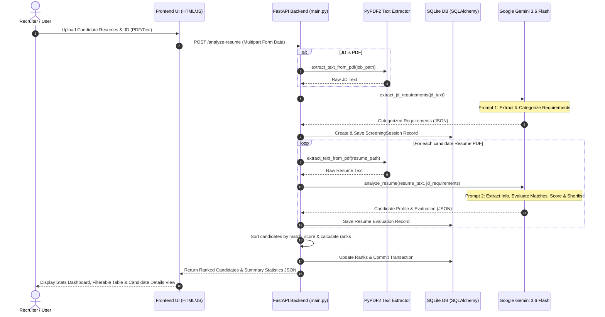

# 📄 Smart Resume Screener

> An end-to-end, AI-powered Applicant Tracking System (ATS) that automates candidate screening, matches resume profiles against job requirements using Google Gemini 3.6 Flash, ranks applicants, and provides interactive analytics.

---

## 📌 Table of Contents

- [Overview](#-overview)
- [Demo Video](#-demo-video)
- [Key Features](#-key-features)
- [System Architecture](#-system-architecture)
- [🤖 LLM Prompts & Prompt Engineering](#-llm-prompts--prompt-engineering)
  - [Prompt 1: Job Description Requirement Extraction](#prompt-1-job-description-requirement-extraction)
  - [Prompt 2: Resume Screening & Candidate Evaluation](#prompt-2-resume-screening--candidate-evaluation)
- [Tech Stack](#-tech-stack)
- [Project Structure](#-project-structure)
- [Getting Started](#-getting-started)
  - [Prerequisites](#prerequisites)
  - [Installation & Setup](#installation--setup)
  - [Environment Variables](#environment-variables)
- [Running the Application](#-running-the-application)
- [API Documentation](#-api-documentation)
- [Database Schema](#-database-schema)
- [License](#-license)

---

## 🚀 Overview

**Smart Resume Screener** solves the recruitment bottleneck by automatically analyzing candidate resumes against any Job Description (JD). Utilizing Google's state-of-the-art **Gemini 3.6 Flash** model, it extracts structured requirement criteria, evaluates candidate qualifications, identifies matched vs. missing skills, assigns an objective match score (0–10), and produces automated shortlisting decisions with AI justifications.

---

## 🎥 Demo Video

Watch the complete demonstration of Smart Resume Screener in action:

🎬 **[Watch Demo Video on Google Drive](https://drive.google.com/file/d/1QeF49nErVZ1rSWrkW0q10KDFRTvrd_wH/view?usp=sharing)**

---

## ✨ Key Features

- **📄 Multi-Resume PDF Processing**: Upload multiple candidate resumes in PDF format simultaneously.
- **📝 Flexible Job Description Input**: Provide JD either as an uploaded PDF document or as pasted text.
- **🎯 Smart Requirement Extraction**: Categorizes Job Description requirements into four precise buckets:
  - 🎓 **Academic**: Degree, branch, CGPA, graduation year, eligibility criteria.
  - 💻 **Technical**: Programming languages, frameworks, databases, tools, system design.
  - 🤝 **Soft Skills**: Communication, teamwork, leadership, collaboration.
  - 🧠 **Behavioral**: Problem solving, adaptability, working under pressure, self-motivation.
- **🔍 Automated Resume Extraction & Matching**: Parses candidate details (Education, Skills, Experience, Projects, Certifications) and checks them against JD requirements.
- **📊 Objective Scoring & AI Justifications**: Computes candidate match scores out of 10 and generates concise recruitment justifications.
- **🏆 Dynamic Candidate Ranking**: Automatically ranks candidates from top score to lowest score.
- **🎛️ Interactive Filtering & Analytics**: View total candidates, shortlisted count, rejected count, and filter candidates by decision status.
- **🔍 Deep Dive Candidate View**: Detailed report highlighting category-by-category matched vs. missing requirements for each applicant.
- **💾 Persistent Database Storage**: Automatically logs all screening sessions and candidate evaluation records in SQLite via SQLAlchemy.

---

## 🏗️ System Architecture

The application is structured into decoupled modules following clean architectural boundaries:



### Component Details
1. **Frontend Layer**: Built with clean Vanilla HTML5, CSS3, and modern JavaScript. Uses Fetch API to interact asynchronously with the backend server and SessionStorage to manage transient evaluation states for seamless page navigation.
2. **REST API Gateway**: Powered by FastAPI with CORS middleware. Handles file ingestion, payload validation, workflow orchestration, database transaction management, and candidate ranking algorithms.
3. **Document Ingestion Engine**: PyPDF2 extracts clean raw text from PDF files for both job descriptions and candidate resumes.
4. **AI & Prompt Execution Layer**: Connects to the `gemini-3.6-flash` model via the `google-generativeai` SDK. Implements two-stage prompt engineering with automated JSON sanitization and fallback parsing.
5. **Persistence Layer**: SQLAlchemy ORM manages SQLite database operations, establishing relational mapping between screening sessions and candidate evaluation records.

---

## 🤖 LLM Prompts & Prompt Engineering

The system utilizes a **two-stage LLM architecture**. The prompts are specifically engineered for high precision, zero hallucination, strict schema adherence, and realistic candidate scoring.

### Prompt 1: Job Description Requirement Extraction

Used in `extract_jd_requirements()` within `backend/llm_service.py` to extract structured criteria from unstructured job description text.

#### System Prompt Template
```text
You are an expert Applicant Tracking System and recruitment requirements extraction system.

Analyze ONLY the following Job Description.

JOB DESCRIPTION:

{job_description}

Extract the requirements that are actually present in the Job Description.

Divide them into exactly these four categories:

1. Academic
2. Technical
3. Soft Skills
4. Behavioral

Academic requirements may include:
- Degree
- Branch
- Graduation year
- CGPA
- Eligibility

Technical requirements may include:
- Programming languages
- Frameworks
- Databases
- Tools
- Coding ability
- Software development
- Testing
- Technical technologies

Soft skills may include:
- Communication
- Interpersonal skills
- Teamwork
- Collaboration
- Leadership
- Presentation skills

Behavioral requirements may include:
- Self starter
- Motivation
- Problem solving
- Positive attitude
- Flexibility
- Adaptability
- Working under pressure
- Working in fast-paced environments

Important rules:
- Only extract requirements explicitly stated or clearly required by the Job Description.
- Do not invent requirements.
- Do not add generic requirements that are not present in the Job Description.
- Preserve the meaning of the original Job Description.

Return ONLY valid JSON.
Use exactly this structure:
{
    "academic": [],
    "technical": [],
    "soft_skills": [],
    "behavioral": []
}

Return valid JSON only.
```

#### Expected JSON Output Schema
```json
{
  "academic": ["B.Tech in Computer Science", "CGPA > 7.5"],
  "technical": ["Python", "FastAPI", "SQLAlchemy", "REST APIs", "Git"],
  "soft_skills": ["Good communication", "Team player"],
  "behavioral": ["Problem solver", "Adaptability"]
}
```

---

### Prompt 2: Resume Screening & Candidate Evaluation

Used in `analyze_resume()` within `backend/llm_service.py` to analyze candidate resumes against the FIXED requirements generated in Stage 1.

#### System Prompt Template
```text
You are an expert Applicant Tracking System and professional recruitment screening system.

Your task is to analyze ONE candidate resume against a FIXED set of Job Description requirements.

The Job Description requirements have already been extracted.
You MUST use exactly these requirements.
Do NOT extract new requirements.
Do NOT modify the requirements.
Do NOT invent requirements.

JOB DESCRIPTION REQUIREMENTS:

{json.dumps(jd_requirements, indent=2)}

RESUME:

{resume_text}

First extract the candidate's information from the resume.
Extract only information that is actually present in the resume.
Do not invent information.

Extract:
1. Candidate name
2. Education
3. Skills
4. Work experience
5. Projects
6. Certifications

Then compare the candidate against the FIXED Job Description requirements.

Academic requirements must be checked against the actual resume.
Technical requirements may be matched using direct evidence or strong reasonable evidence.
For example, if the requirement is strong coding skills and the resume contains Java, Python, Data Structures and Algorithms and software development projects, consider the requirement matched.

Do not assume soft skills are present without evidence.
Do not assume communication skills merely because the candidate has projects, certifications or a degree.
Do not assume interpersonal skills merely because the candidate has teamwork-related experience unless there is evidence.

A requirement is MATCHED when the resume directly mentions it or provides strong reasonable evidence.
A requirement is MISSING when the requirement exists in the Job Description and the resume provides insufficient evidence.

Every matched or missing item MUST come from the supplied Job Description requirements.
Do not invent new requirements.
Do not list resume skills that are unrelated to the Job Description.

Calculate a realistic match score from 0 to 10.
The score must consider:
- Academic requirements
- Technical requirements
- Soft skills
- Behavioral requirements
- Overall suitability

Do not automatically give 10/10 because academic requirements are satisfied.

The shortlist decision should consider important mandatory requirements and overall suitability.
Return "Yes" if the candidate satisfies important mandatory requirements and is reasonably suitable.
Return "No" if important mandatory requirements are not satisfied.
Do not reject a candidate only because one soft skill is not explicitly written in the resume when the candidate otherwise strongly satisfies the role.

Give a concise professional justification.

Return ONLY valid JSON.
Use exactly this structure:

{
    "candidate": {
        "name": "",
        "education": [],
        "skills": [],
        "experience": [],
        "projects": [],
        "certifications": []
    },
    "match_score": 0,
    "requirements": {
        "academic": {
            "matched": [],
            "missing": []
        },
        "technical": {
            "matched": [],
            "missing": []
        },
        "soft_skills": {
            "matched": [],
            "missing": []
        },
        "behavioral": {
            "matched": [],
            "missing": []
        }
    },
    "shortlist": "Yes",
    "justification": ""
}

Rules:
- match_score must be a number from 0 to 10.
- shortlist must be exactly "Yes" or "No".
- matched arrays must contain only requirements from the supplied Job Description requirements.
- missing arrays must contain only requirements from the supplied Job Description requirements.
- Do not invent requirements.
- Do not invent resume evidence.
- Candidate information must come only from the resume.
- Keep the justification concise.
- Return valid JSON only.
```

#### Expected JSON Output Schema
```json
{
  "candidate": {
    "name": "Jane Doe",
    "education": ["B.Tech in CS, 2024"],
    "skills": ["Python", "FastAPI", "Docker", "SQL"],
    "experience": ["Software Engineer Intern at Tech Corp"],
    "projects": ["AI Resume Screening App"],
    "certifications": ["AWS Certified Cloud Practitioner"]
  },
  "match_score": 8.5,
  "requirements": {
    "academic": {
      "matched": ["B.Tech in Computer Science"],
      "missing": []
    },
    "technical": {
      "matched": ["Python", "FastAPI", "REST APIs", "Git"],
      "missing": ["Kubernetes"]
    },
    "soft_skills": {
      "matched": ["Good communication"],
      "missing": []
    },
    "behavioral": {
      "matched": ["Problem solver"],
      "missing": ["Working under high pressure"]
    }
  },
  "shortlist": "Yes",
  "justification": "Candidate strongly matches technical and academic criteria with hands-on experience in FastAPI and Python."
}
```

---

## 🛠️ Tech Stack

### Backend
- **Language**: Python 3.9+
- **Framework**: [FastAPI](https://fastapi.tiangolo.com/)
- **ASGI Server**: [Uvicorn](https://www.uvicorn.org/)
- **ORM / Database**: [SQLAlchemy](https://www.sqlalchemy.org/) + SQLite
- **PDF Text Extraction**: [PyPDF2](https://pypdf2.readthedocs.io/)

### AI & LLM Engine
- **SDK**: `google-generativeai`
- **Model**: `gemini-3.6-flash`

### Frontend
- **Structure & Logic**: Vanilla HTML5, CSS3, JavaScript (ES6+, Fetch API, SessionStorage)
- **Design System**: Modern, responsive layout with clean cards, stats badges, and status tables

---

## 📁 Project Structure

```text
smart-resume-screener/
│
├── backend/
│   ├── main.py              # FastAPI application & REST API routes
│   ├── llm_service.py       # Gemini AI prompts for JD extraction & resume analysis
│   ├── resume_parser.py     # PDF text extraction using PyPDF2
│   └── database.py          # SQLAlchemy database connection and models
│
├── frontend/
│   ├── index.html           # Main dashboard for file upload, stats & candidate ranking
│   └── candidate-details.html # Detailed candidate analysis & requirement checklist
│
├── job_descriptions/        # Directory for uploaded JD PDFs
├── resumes/                 # Directory for uploaded candidate Resume PDFs
├── resume_screener.db       # SQLite database file (auto-generated)
├── requirements.txt         # Python project dependencies
├── .gitignore               # Git ignore rules for venv, DB, uploads, and secrets
└── README.md                # Project documentation
```

---

## ⚙️ Getting Started

### Prerequisites

Ensure you have the following installed on your system:
- **Python 3.9+**: [Download Python](https://www.python.org/downloads/)
- **Git**: [Download Git](https://git-scm.com/)
- **Google Gemini API Key**: [Get API Key from Google AI Studio](https://aistudio.google.com/)

### Installation & Setup

1. **Clone the Repository**
   ```bash
   git clone https://github.com/JaswanthChintha/smart_resume_screener.git
   cd smart_resume_screener
   ```

2. **Create & Activate a Virtual Environment**

   - **Windows (PowerShell)**:
     ```powershell
     python -m venv venv
     .\venv\Scripts\Activate
     ```
   - **Linux / macOS**:
     ```bash
     python3 -m venv venv
     source venv/bin/activate
     ```

3. **Install Dependencies**
   ```bash
   pip install -r requirements.txt
   ```

### Environment Variables

Set your Google Gemini API key as an environment variable before launching the server:

- **Windows (PowerShell)**:
  ```powershell
  $env:GEMINI_API_KEY="your_gemini_api_key_here"
  ```
- **Windows (Command Prompt)**:
  ```cmd
  set GEMINI_API_KEY=your_gemini_api_key_here
  ```
- **Linux / macOS**:
  ```bash
  export GEMINI_API_KEY="your_gemini_api_key_here"
  ```

---

## 🏃 Running the Application

### 1. Start the Backend API Server

Run the FastAPI application using Uvicorn on port `8000`:

```bash
uvicorn backend.main:app --reload --port 8000
```

The API server will be available at `http://127.0.0.1:8000`. You can test the health endpoint at `http://127.0.0.1:8000/`.

### 2. Launch the Frontend Interface

Serve the `frontend` folder using any static HTTP server or open `frontend/index.html` directly in your web browser.

Using Python's built-in HTTP server on port `8080`:

```bash
# In a new terminal window
python -m http.server 8080 --directory frontend
```

Open your browser and navigate to:
```text
http://127.0.0.1:8080/
```

---

## 🔌 API Documentation

### Available Endpoints

| Method | Endpoint | Description |
| :--- | :--- | :--- |
| `GET` | `/` | Health check endpoint returning backend status message. |
| `POST` | `/analyze-resume` | Upload resume PDFs and JD (PDF or text) to run AI screening. |
| `GET` | `/screening/{session_id}` | Retrieve all screening results and candidates for a specific session. |
| `GET` | `/resume/{resume_id}` | Fetch detailed evaluation and candidate profile by resume ID. |

#### Request Example (`POST /analyze-resume`)
- **Content-Type**: `multipart/form-data`
- **Body Parameters**:
  - `resume_files`: Array of PDF files (Required)
  - `job_file`: PDF file containing Job Description (Optional)
  - `job_description`: Plain text string of Job Description (Optional)

---

## 🗄️ Database Schema

The application uses SQLAlchemy with SQLite (`resume_screener.db`):

- **`screening_sessions`**: Stores individual screening sessions including `job_source`, `job_description`, and parsed `jd_requirements` JSON.
- **`resumes`**: Stores candidate records including parsed fields (`name`, `education`, `skills`, `experience`, `projects`, `certifications`), `resume_text`, `match_score`, `shortlist` decision ("Yes"/"No"), AI `justification`, category breakdown `requirements`, and candidate `rank`.

---

## 📝 License

This project is licensed under the MIT License - see the LICENSE file for details.
