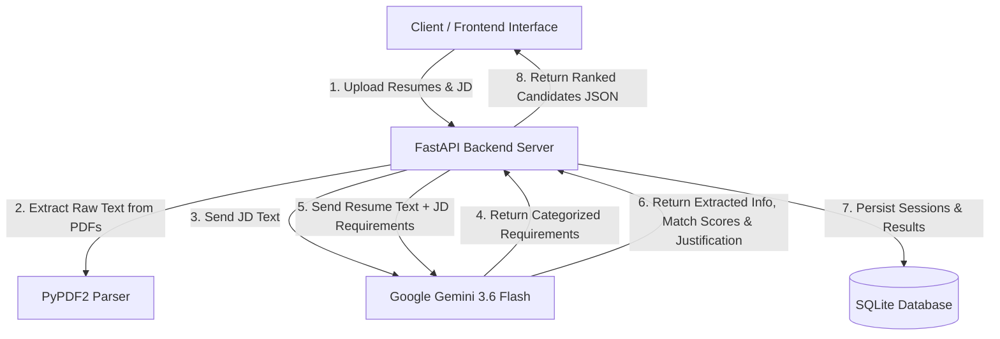

# 📄 Smart Resume Screener

> An end-to-end, AI-powered Applicant Tracking System (ATS) that automates candidate screening, matches resume profiles against job requirements using Google Gemini 3.6 Flash, ranks applicants, and provides interactive analytics.

---

## 📌 Table of Contents

- [Overview](#-overview)
- [Key Features](#-key-features)
- [Tech Stack](#-tech-stack)
- [Project Architecture](#-project-architecture)
- [Project Structure](#-project-structure)
- [Getting Started](#-getting-started)
  - [Prerequisites](#prerequisites)
  - [Installation & Setup](#installation--setup)
  - [Environment Variables](#environment-variables)
- [Running the Application](#-running-the-application)
- [API Documentation](#-api-documentation)
- [Database Schema](#-database-schema)
- [License](#-license)

---

## 🚀 Overview

**Smart Resume Screener** solves the recruitment bottleneck by automatically analyzing candidate resumes against any Job Description (JD). Utilizing Google's state-of-the-art **Gemini 3.6 Flash** model, it extracts structured requirement criteria, evaluates candidate qualifications, identifies matched vs. missing skills, assigns an objective match score (0–10), and produces automated shortlisting decisions with AI justifications.

---

## ✨ Key Features

- **📄 Multi-Resume PDF Processing**: Upload multiple candidate resumes in PDF format simultaneously.
- **📝 Flexible Job Description Input**: Provide JD either as an uploaded PDF document or as pasted text.
- **🎯 Smart Requirement Extraction**: Categorizes Job Description requirements into four precise buckets:
  - 🎓 **Academic**: Degree, branch, CGPA, graduation year, eligibility criteria.
  - 💻 **Technical**: Programming languages, frameworks, databases, tools, system design.
  - 🤝 **Soft Skills**: Communication, teamwork, leadership, collaboration.
  - 🧠 **Behavioral**: Problem solving, adaptability, working under pressure, self-motivation.
- **🔍 Automated Resume Extraction & Matching**: Parses candidate details (Education, Skills, Experience, Projects, Certifications) and checks them against JD requirements.
- **📊 Objective Scoring & AI Justifications**: Computes candidate match scores out of 10 and generates concise recruitment justifications.
- **🏆 Dynamic Candidate Ranking**: Automatically ranks candidates from top score to lowest score.
- **🎛️ Interactive Filtering & Analytics**: View total candidates, shortlisted count, rejected count, and filter candidates by decision status.
- **🔍 Deep Dive Candidate View**: Detailed report highlighting category-by-category matched vs. missing requirements for each applicant.
- **💾 Persistent Database Storage**: Automatically logs all screening sessions and candidate evaluation records in SQLite via SQLAlchemy.

---

## 🛠️ Tech Stack

### Backend
- **Language**: Python 3.9+
- **Framework**: [FastAPI](https://fastapi.tiangolo.com/)
- **ASGI Server**: [Uvicorn](https://www.uvicorn.org/)
- **ORM / Database**: [SQLAlchemy](https://www.sqlalchemy.org/) + SQLite
- **PDF Text Extraction**: [PyPDF2](https://pypdf2.readthedocs.io/)

### AI & LLM Engine
- **SDK**: `google-generativeai`
- **Model**: `gemini-3.6-flash`

### Frontend
- **Structure & Logic**: Vanilla HTML5, CSS3, JavaScript (ES6+, Fetch API, SessionStorage)
- **Design System**: Modern, responsive layout with clean cards, stats badges, and status tables

---

## 🏗️ Project Architecture



---

## 📁 Project Structure

```text
smart-resume-screener/
│
├── backend/
│   ├── main.py              # FastAPI application & REST API routes
│   ├── llm_service.py       # Gemini AI prompts for JD extraction & resume analysis
│   ├── resume_parser.py     # PDF text extraction using PyPDF2
│   └── database.py          # SQLAlchemy database connection and models
│
├── frontend/
│   ├── index.html           # Main dashboard for file upload, stats & candidate ranking
│   └── candidate-details.html # Detailed candidate analysis & requirement checklist
│
├── job_descriptions/        # Directory for uploaded JD PDFs
├── resumes/                 # Directory for uploaded candidate Resume PDFs
├── resume_screener.db       # SQLite database file (auto-generated)
├── requirements.txt         # Python project dependencies
├── .gitignore               # Git ignore rules for venv, DB, uploads, and secrets
└── README.md                # Project documentation
```

---

## ⚙️ Getting Started

### Prerequisites

Ensure you have the following installed on your system:
- **Python 3.9+**: [Download Python](https://www.python.org/downloads/)
- **Git**: [Download Git](https://git-scm.com/)
- **Google Gemini API Key**: [Get API Key from Google AI Studio](https://aistudio.google.com/)

### Installation & Setup

1. **Clone the Repository**
   ```bash
   git clone https://github.com/JaswanthChintha/smart_resume_screener.git
   cd smart_resume_screener
   ```

2. **Create & Activate a Virtual Environment**

   - **Windows (PowerShell)**:
     ```powershell
     python -m venv venv
     .\venv\Scripts\Activate
     ```
   - **Linux / macOS**:
     ```bash
     python3 -m venv venv
     source venv/bin/activate
     ```

3. **Install Dependencies**
   ```bash
   pip install -r requirements.txt
   ```

### Environment Variables

Set your Google Gemini API key as an environment variable before launching the server:

- **Windows (PowerShell)**:
  ```powershell
  $env:GEMINI_API_KEY="your_gemini_api_key_here"
  ```
- **Windows (Command Prompt)**:
  ```cmd
  set GEMINI_API_KEY=your_gemini_api_key_here
  ```
- **Linux / macOS**:
  ```bash
  export GEMINI_API_KEY="your_gemini_api_key_here"
  ```

---

## 🏃 Running the Application

### 1. Start the Backend API Server

Run the FastAPI application using Uvicorn on port `8000`:

```bash
uvicorn backend.main:app --reload --port 8000
```

The API server will be available at `http://127.0.0.1:8000`. You can test the health endpoint at `http://127.0.0.1:8000/`.

### 2. Launch the Frontend Interface

Serve the `frontend` folder using any static HTTP server or open `frontend/index.html` directly in your web browser.

Using Python's built-in HTTP server on port `8080`:

```bash
# In a new terminal window
python -m http.server 8080 --directory frontend
```

Open your browser and navigate to:
```text
http://127.0.0.1:8080/
```

---

## 🔌 API Documentation

### Available Endpoints

| Method | Endpoint | Description |
| :--- | :--- | :--- |
| `GET` | `/` | Health check endpoint returning backend status message. |
| `POST` | `/analyze-resume` | Upload resume PDFs and JD (PDF or text) to run AI screening. |
| `GET` | `/screening/{session_id}` | Retrieve all screening results and candidates for a specific session. |
| `GET` | `/resume/{resume_id}` | Fetch detailed evaluation and candidate profile by resume ID. |

#### Request Example (`POST /analyze-resume`)
- **Content-Type**: `multipart/form-data`
- **Body Parameters**:
  - `resume_files`: Array of PDF files (Required)
  - `job_file`: PDF file containing Job Description (Optional)
  - `job_description`: Plain text string of Job Description (Optional)

---

## 🗄️ Database Schema

The application uses SQLAlchemy with SQLite (`resume_screener.db`):

- **`screening_sessions`**: Stores individual screening sessions including `job_source`, `job_description`, and parsed `jd_requirements` JSON.
- **`resumes`**: Stores candidate records including parsed fields (`name`, `education`, `skills`, `experience`, `projects`, `certifications`), `resume_text`, `match_score`, `shortlist` decision ("Yes"/"No"), AI `justification`, category breakdown `requirements`, and candidate `rank`.

---

## 📝 License

This project is licensed under the MIT License - see the LICENSE file for details.
